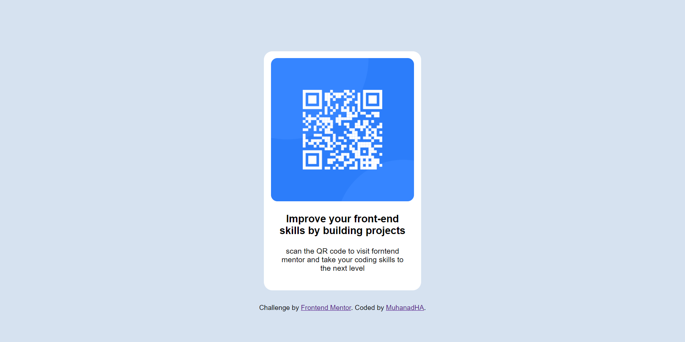

# Frontend Mentor - QR code component solution

This is a solution to the [QR code component challenge on Frontend Mentor](https://www.frontendmentor.io/challenges/qr-code-component-iux_sIO_H). Frontend Mentor challenges help you improve your coding skills by building realistic projects. 

## Table of contents

- [Overview](#overview)
  - [Screenshot](#screenshot)
  - [Links](#links)
- [My process](#my-process)
  - [Built with](#built-with)
  - [What I learned](#what-i-learned)
  - [Continued development](#continued-development)
  - [Useful resources](#useful-resources)
- [Author](#author)
- [Acknowledgments](#acknowledgments)

## Overview

### Screenshot

###Links
the site:
https://dazzling-ardinghelli-4ba903.netlify.app

## My process

### Built with

- Semantic HTML5 markup
- CSS custom properties

### What I learned

first of all, I haven't code since last year, I was busy with collage, it's my last year and we have a project to do...

anyway, this project help with reviewing the basics of HTML and CSS, it also helped to gain some trust that I actually needed.

I struggled with the ordering of the elements and how to structure them, I first thought that I should use CSS grid, but I ended up not needing it because the layout is too simple...

after that I eyeballed the font size, paddings, margins...etc, and got it as close to the desired design as I can.

### Continued development

I want to do another project that focuses on HTML and CSS, I need more reviewing and practicing, after that I will start projects that uses js, I'll do a couple of those as well then, get a course to learn a framework.

### Useful resources

- [Google Fonts](https://fonts.google.com/) - used this for the fonts.
- [W3school](https://www.w3schools.com/) - I reviewed some of the basic concepts to get me going with the project.

## Author

- Website - [MuhanadHA](https://github.com/MuhanadHA/)
- Frontend Mentor - [@MuhanadHA](https://www.frontendmentor.io/profile/yourusername)
- Twitter - [@MuhanadHAmeen](https://twitter.com/MuhanadHAmeen)

## Acknowledgments

I just thank the frontend mentor for these interesting challenges...
